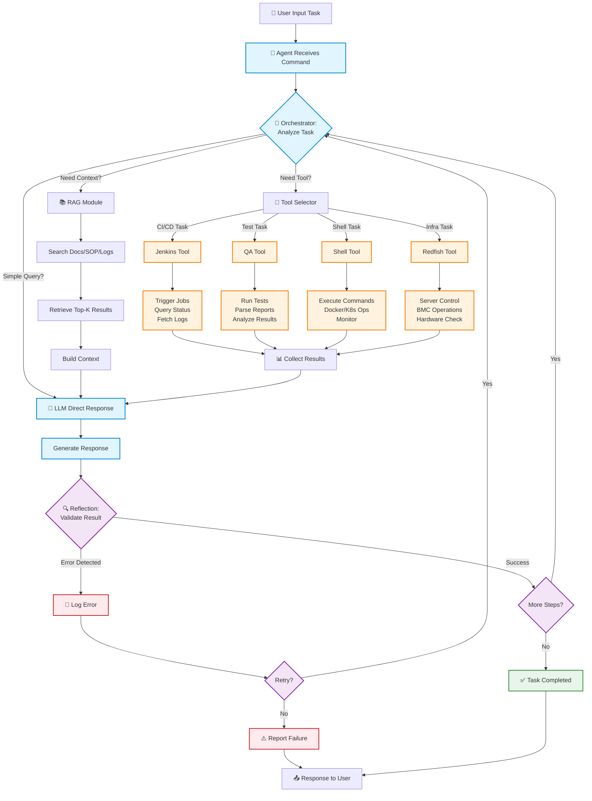

# Local Engineer Agent - Feature Plan

## 🎯 Overview

本專案目標是建立一個 **本地工程師 AI Agent**，能夠：
- 自動化 CI/CD pipeline 操作（Jenkins）
- 執行與管理測試（QA Automation）
- 管理基礎設施（Shell、Docker、K8s、Redfish）
- 透過 RAG 查詢文件、SOP、log
- 支援多種 LLM（Ollama、Local GPT、OpenAI API）

## 🏗️ Architecture Components

### 1️⃣ Core Agent
**主要功能：**
- **Orchestrator** - 任務分解、工具選擇、執行順序規劃
- **Agent Loop** - 接收指令 → 決策 → 執行 → 回饋 → 迭代
- **Memory** - 對話歷史、執行記錄、context 管理
- **LLM Client** - 支援多種 LLM backend（可切換）
- **Reflection** - 自我檢查、錯誤重試、結果驗證

**技術特點：**
- Async/concurrent execution
- Error handling & retry mechanism
- Logging & monitoring

### 2️⃣ Tools Module (MCP-based)
**設計原則：**
- 每個工具一個模組，獨立可測試
- 統一介面（MCP protocol / function calling）
- 插拔式設計，易於擴充

**工具清單：**
- `jenkins_tool` - Trigger jobs、query status、get logs
- `qa_tool` - Run pytest、parse reports、summarize results
- `shell_tool` - Execute local commands、docker、kubectl
- `redfish_tool` - Server management、IPMI、BMC operations
- `search_tool` - RAG 查詢文件、SOP、Markdown

### 3️⃣ RAG Module (Optional)
**功能：**
- Vector database（FAISS / Chroma / Simple JSON）
- Embedding generation（local model / OpenAI）
- Semantic search - top-k retrieval
- Document indexing - SOP、logs、code docs

**使用場景：**
- 查詢內部 SOP
- 搜尋相關 log 片段
- Code documentation lookup

---

## 📋 Feature Roadmap

### 🔹 POC Stage - Proof of Concept

**目標：** 快速驗證核心功能可行性

#### POC-1: Jenkins Integration (Week 1)
- [ ] 基礎 LLM client（Ollama or OpenAI）
- [ ] Simple agent loop
- [ ] Jenkins tool: trigger job、query status
- [ ] Basic error handling
- **測試方式：** 使用者輸入 "trigger build job X"，Agent 執行並回報結果

#### POC-2: QA Automation (Week 1-2)
- [ ] QA tool: run pytest、parse XML/JSON reports
- [ ] Result summarization
- [ ] Integration with agent
- **測試方式：** "run smoke tests and report failures"

#### POC-3: Shell Commands (Week 2)
- [ ] Shell tool: execute safe commands
- [ ] Docker basic operations
- [ ] Output parsing
- **測試方式：** "check docker containers status"

**POC 成功標準：**
- 單一工具可獨立運作
- Agent 能正確選擇並呼叫工具
- 基本錯誤處理

---

### 🔹 Phase 1 - Pipeline & Build (Week 3-4)

**目標：** 完整 CI/CD 自動化

**核心功能：**
- [ ] Multi-step task orchestration
- [ ] Jenkins advanced operations:
  - Trigger with parameters
  - Monitor build progress
  - Fetch & analyze logs
  - Restart failed jobs
- [ ] Build artifact management
- [ ] Notification & reporting

**使用案例：**
- "Start nightly build with debug mode"
- "Check last 5 builds status and summarize failures"
- "Restart failed jobs from yesterday"

**技術升級：**
- Task planning & sequencing
- Concurrent tool execution
- Better error recovery

---

### 🔹 Phase 2 - QA & Test Automation (Week 5-6)

**目標：** 智慧測試管理

**核心功能：**
- [ ] Test suite management:
  - Select tests by tags/modules
  - Run parallel tests
  - Flaky test detection
- [ ] Report analysis:
  - Parse pytest/unittest/robot reports
  - Identify failure patterns
  - Generate executive summary
- [ ] Test result comparison:
  - Compare with baseline
  - Regression detection
- [ ] Integration with Jenkins

**使用案例：**
- "Run API tests and compare with baseline"
- "Analyze test failures from last week, group by root cause"
- "Run only failed tests from previous run"

**技術升級：**
- Advanced report parsing
- Statistical analysis
- Test result database (optional)

---

### 🔹 Phase 3 - Infrastructure Management (Week 7-9)

**目標：** 基礎設施自動化管理

**核心功能：**
- [ ] Shell operations:
  - Safe command execution
  - File operations
  - System monitoring
- [ ] Docker management:
  - Container lifecycle
  - Image management
  - Resource monitoring
- [ ] Kubernetes operations:
  - Pod/deployment management
  - Log collection
  - Resource scaling
- [ ] Redfish/IPMI:
  - Server power control
  - Hardware monitoring
  - BMC operations

**使用案例：**
- "Check all k8s pods in production and restart unhealthy ones"
- "Power cycle server rack-5-node-3"
- "Scale up worker pods to 10 replicas"

**技術升級：**
- Safety mechanisms (approval for dangerous ops)
- Multi-host orchestration
- Resource state management

---

### 🔹 Phase 4 - RAG & Knowledge Base (Week 10-11)

**目標：** 智慧文件查詢與知識管理

**核心功能：**
- [ ] Document indexing:
  - SOP documents
  - Code documentation
  - Historical logs
- [ ] Embedding & vector DB setup
- [ ] Semantic search integration
- [ ] Context-aware responses

**使用案例：**
- "How do we deploy to production according to SOP?"
- "Find similar error logs from past month"
- "What's the procedure for server maintenance?"

**技術升級：**
- Local embedding model (all-MiniLM, BGE)
- FAISS or Chroma integration
- Smart context assembly

---

### 🔹 Phase 5 - Advanced Features (Week 12+)

**目標：** 進階功能與優化

**功能列表：**
- [ ] Multi-agent collaboration
- [ ] Long-running task management
- [ ] Scheduled operations
- [ ] Web UI / API server
- [ ] Metrics & analytics
- [ ] Security & access control
- [ ] Custom tool creation framework

---

## 🎯 Success Metrics

### POC Stage
- ✅ Each tool works independently
- ✅ Agent can call tools correctly
- ✅ Basic error handling works

### Phase 1-3
- ✅ Complex multi-step tasks execution
- ✅ 90%+ tool call accuracy
- ✅ Proper error recovery
- ✅ User satisfaction on real tasks

### Phase 4-5
- ✅ RAG improves response quality
- ✅ Reduced manual operations by 70%
- ✅ System stability (uptime > 95%)

---

## 🛠️ Technical Stack

**Core:**
- Python 3.10+
- Async/await (asyncio)
- LangChain / LlamaIndex (optional)

**LLM:**
- Ollama (local)
- OpenAI API
- Anthropic Claude (optional)

**Tools:**
- Jenkins API (python-jenkins)
- pytest / unittest
- docker-py
- kubernetes client
- redfish library

**RAG:**
- FAISS / Chroma
- sentence-transformers
- tiktoken (token counting)

**Infrastructure:**
- FastAPI (if building API)
- SQLite (simple storage)
- Docker (containerization)

---

## 📁 Project Structure

```bash
local_engineer_agent/
│
├── core/                       # Core agent logic
│   ├── __init__.py
│   ├── agent.py                # Main agent loop & entry point
│   ├── orchestrator.py         # Task planning & tool selection
│   ├── memory.py               # Conversation history & context
│   └── reflection.py           # Self-check & error recovery
│
├── llm/                        # LLM client abstraction
│   ├── __init__.py
│   ├── base.py                 # Base LLM interface
│   ├── ollama_client.py        # Ollama integration
│   ├── openai_client.py        # OpenAI API integration
│   └── config.py               # LLM configurations
│
├── tools/                      # MCP-based tool modules
│   ├── __init__.py
│   ├── base_tool.py            # Base tool interface
│   ├── jenkins_tool.py         # Jenkins operations
│   ├── qa_tool.py              # Test automation
│   ├── shell_tool.py           # Shell commands, docker, k8s
│   ├── redfish_tool.py         # Server management (Redfish/IPMI)
│   └── search_tool.py          # RAG document search
│
├── rag/                        # RAG module (Phase 4)
│   ├── __init__.py
│   ├── embedding.py            # Embedding generation
│   ├── vector_db.py            # FAISS/Chroma wrapper
│   ├── indexer.py              # Document indexing
│   └── retriever.py            # Semantic search
│
├── poc/                        # POC scripts (standalone)
│   ├── poc1_jenkins.py         # Jenkins POC
│   ├── poc2_qa.py              # QA POC
│   └── poc3_shell.py           # Shell POC
│
├── phases/                     # Phase implementations
│   ├── phase1_pipeline.py      # Phase 1: Pipeline & Build
│   ├── phase2_qa.py            # Phase 2: QA & Test
│   └── phase3_infra.py         # Phase 3: Infrastructure
│
├── utils/                      # Utilities
│   ├── logger.py               # Logging setup
│   ├── config.py               # Global config
│   └── helpers.py              # Common functions
│
├── tests/                      # Unit & integration tests
│   ├── test_core/
│   ├── test_tools/
│   └── test_rag/
│
├── data/                       # Data storage
│   ├── docs/                   # SOP documents for RAG
│   ├── logs/                   # Agent execution logs
│   └── cache/                  # Temporary cache
│
├── config/                     # Configuration files
│   ├── agent_config.yaml       # Agent settings
│   ├── tools_config.yaml       # Tool configurations
│   └── llm_config.yaml         # LLM settings
│
├── main.py                     # CLI entry point
├── requirements.txt            # Python dependencies
├── README.md                   # Project documentation
└── .env.example                # Environment variables template
```

---

## 🔄 Agent Flow Diagram



### Flow 說明

1. **Input Stage** - 使用者輸入任務
2. **Orchestrator** - 分析任務、決定執行策略
3. **RAG (Optional)** - 若需要背景知識，查詢文件庫
4. **Tool Selection** - 選擇適當的工具執行任務
5. **Execution** - 工具執行實際操作
6. **Reflection** - 自我檢查結果是否正確
7. **Iteration** - 如有需要，重試或執行後續步驟
8. **Output** - 回傳最終結果給使用者

---

## 🚀 Quick Start

### 1. Installation

```bash
# Clone repository
git clone <repo-url>
cd local_engineer_agent

# Create virtual environment
python -m venv venv
source venv/bin/activate  # On Windows: venv\Scripts\activate

# Install dependencies
pip install -r requirements.txt
```

### 2. Configuration

```bash
# Copy example config
cp .env.example .env

# Edit configuration
nano .env
```

Required settings:
```bash
# LLM Configuration
LLM_PROVIDER=ollama  # or openai
OLLAMA_BASE_URL=http://localhost:11434
OLLAMA_MODEL=llama3.2

# Tool Configurations
JENKINS_URL=http://your-jenkins:8080
JENKINS_USER=your-user
JENKINS_TOKEN=your-token

# Optional: RAG
ENABLE_RAG=false
```

### 3. Run POC

```bash
# Run Jenkins POC
python poc/poc1_jenkins.py

# Run QA POC
python poc/poc2_qa.py

# Run Shell POC
python poc/poc3_shell.py
```

### 4. Run Main Agent

```bash
# Interactive mode
python main.py

# Single task mode
python main.py --task "trigger build job my-project"

# With specific tools
python main.py --tools jenkins,qa --task "run tests"
```

---

## 📝 Development Guidelines

### Adding New Tools

1. Create tool file in `tools/`
2. Inherit from `BaseTool`
3. Implement required methods:
   - `name()` - Tool identifier
   - `description()` - What the tool does
   - `execute()` - Main logic
4. Register tool in `tools/__init__.py`

Example:
```python
# tools/my_tool.py
from tools.base_tool import BaseTool

class MyTool(BaseTool):
    def name(self) -> str:
        return "my_tool"
    
    def description(self) -> str:
        return "Does something useful"
    
    async def execute(self, **kwargs):
        # Tool logic here
        return result
```

### Testing

```bash
# Run all tests
pytest

# Run specific test
pytest tests/test_tools/test_jenkins.py

# With coverage
pytest --cov=local_engineer_agent
```

---

## 🤝 Contributing

歡迎貢獻！請遵循以下步驟：

1. Fork 專案
2. 建立 feature branch (`git checkout -b feature/amazing-feature`)
3. Commit 修改 (`git commit -m 'Add amazing feature'`)
4. Push to branch (`git push origin feature/amazing-feature`)
5. 開 Pull Request

---

## 📖 Resources

- [MCP Protocol Documentation](https://modelcontextprotocol.io/)
- [LangChain Documentation](https://python.langchain.com/)
- [Ollama Documentation](https://ollama.ai/docs)

---

## 📄 License

MIT License - 詳見 LICENSE 檔案